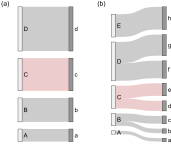
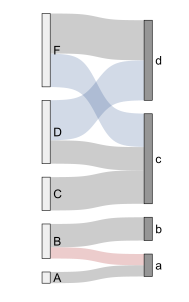
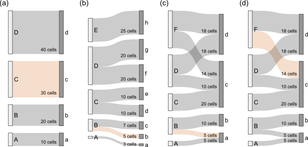

# The `coherence` metric

In the application, when a data frame is provided as input, we study annotations using two metrics. One of them is the adjusted mutual information score, a well known [metric](https://en.wikipedia.org/wiki/Adjusted_mutual_information) for comparing classifications that ranges from 0 (random classification) to 1 (identical classification). This compares the overall similarity across annotations or clustering results. The second metric that we use to assess how well a particular subset of cells is classified is what we call the coherence metric. A coherence metric is an attempt to understand the extent to which the two classifications are coherent or incoherent to each other. This begs the question: what does it mean to be coherent?

In the figure above you can see two examples of a coherent classification, where the relationships are 1 to 1 and 1 to 2 in panels (a) and (b), respectively. That is, we can see that class 'C' in the left side of panel (a) is always linked to class 'c' on the right side, where class 'c' is not linked to any other class. Likewise, class 'C' in the left side of panel (b) is always linked to classes 'e' and 'd', where neither class is linked to any other class. Notice that the panel (b) would represent the comparison between perfect classifications that are defined at different resolutions. 

So, what does it mean to be incoherent?

Above is an example of two classifications that are incoherent for certain classes. For example, class 'B' on the left side of the diagram is linked to either class 'b' or class 'a'; however, class 'a' on the right side is in turn associated to classes 'B' and 'A'. This is an incoherent classification because the differences reflected by the link 'B-a' (red link) were not picked up by either classification. Likewise, another example of these incoherences is the fact that classes 'D' and 'F' are both linked to classes 'c' and 'd', which implies that there are points for which the different classifications disagree (blue links).

How can we define a measure that assesses the extent that a particular link or node is part of coherent or incoherent set of annotations/classifications? One way to do this is by considering the nodes part of the local network. Say that we select the link 'B-a', we consider the nodes on the right side of the network that interact with 'B', and those on the left side that interact with 'a'. This sub-network $X_{n \times m}$ formed by the $n$ classes interacting with 'B' and the $m$ classes interacting with 'a'&mdash;where $x_{Ba}$ represent cells annotated as 'B' and 'a'&mdash;allows us to assess the extent to which the link shows coherence or incoherence across annotations. To do so, we define a very simple measure of coherence: 

$$
\begin{cases}
    \frac{\sum^{n}_{i}\max_{j}\left(x_{ij}\right)}{\sum_{ij} x_{ij}}, & n>m,\\
    \frac{\sum^{m}_{j}\max_{i}\left(x_{ij}\right)}{\sum_{ij} x_{ij}}, & n<=m.
\end{cases}
$$

For reference, let's calculate the coherence of four links in the four networks below.

For each case, imagine that we are comparing two annotations in a set of 100 cells. In each panel, the measure of coherence of the highlighted links is as follows: (a) $1$, (b) $1$, (c) $0.75$, and (d) $0.7$. Notice how the measure considers the annotations in first two cases as fully coherent with each other while somewhat incoherent the other two cases.

Now the same idea can be applied to nodes. The only difference here is with the selection of the sub-network. Considering node 'B' from figure 2, we define the sub-network for this node as the network formed by those nodes interacting with 'B' (i.e. 'a' and 'b') as well as the nodes interacting with them (i.e. 'A' and 'B').
